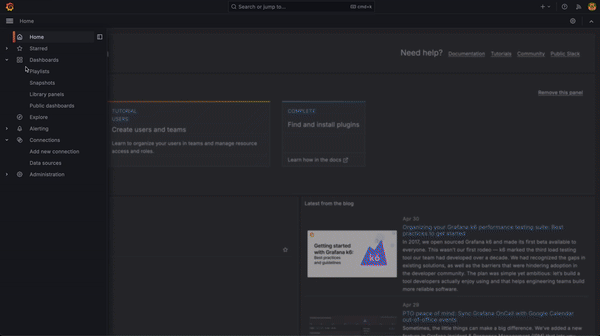

# Drifting through the Cosmos

Solution to GNO challenge by Sergio Matone.
The purpose of the challenge is to visually display aggregated data of blockchain transactions.



## Prerequisites

* Docker suite (build,compose...) >= 20.04

## Preliminary steps

* create the file `grafana/grafana.ini` containing the plain text password for Grafana dashboard

## Running

* Bootstrap the basic configuration

```bash
docker compose up -d
```

This will launch all the services, but `supernova` will fail quite immediately.
That is because we will use `supernova` as stress test and launch it multiple times.

* Launch a stress test

```bash
docker compose run --rm supernova
```

  Or with specific parameters

```bash
docker compose run --rm supernova -sub-accounts 5 -transactions 500 -url http://gnoland:26657 -mode REALM_CALL
-mnemonic "source bonus chronic canvas draft south burst lottery vacant surface solve popular case indicate oppose farm nothing bullet exhibit title speed wink action roast"
```

* Check out the Grafana dashboard by visiting `http://127.0.0.1:3000/dashboards` and after logging in navigate to the `Gnoland Dashboard`
(use the credentials defined into `grafana.ini` file)

Eventually run more stress tests to see panels of the dashboard getting updated in real time.

## Cleanup

To wipe everything or start from scratch:

```bash
docker compose down -v
```

## Services within this Cosmos

* `gnoland`: Gno.land blockchain node
* `gnoweb`: Gno.land web interface
* `tx-indexer`: transaction indexer
* `supernova`: network activity simulator
* `houston`: an aggragetor of transaction metrics
* `grafana`: the dashboard unit using Grafana dashboard

## Notes on Houston

* Check [Houston](houston/README.md)

## Docker Images of service

* `sw360cab/aib-gnoland`: `gnoland` image based on
([Dockerfile in git repo](https://raw.githubusercontent.com/gnolang/gno/master/Dockerfile)) using code slightly modified. See [details](Assumptions.md/#gnoland)
* `sw360cab/aib-gnoweb`: same as `gnoland`
* `sw360cab/aib-tx-indexer`: image created using git repo [`Dockerfile`](https://raw.githubusercontent.com/gnolang/tx-indexer/main/Dockerfile)
* `sw360cab/aib-supernova`: image created using git repo source code and a custom [Dockerfile](supernova-build/supernova.Dockerfile)
* `houston`: custom multi-stage `Dockerfile` for Go applications
* `grafana`: official image provided by Grafana

## Data pipeline

This is the flow of data that is supposed to happen:

```txt
supernova -> gnoland -> tx-indexer -> houston -> dashboard
```

This can be also imagined as a diagram of communication between each service.

## Volumes and networks

* The following volumes are defined
  * `gnoland-vol`: persists data od `gnoland`
  * `indexer-vol`: persists data of `tx-indexer`
    * the destination path should correspond in the command line argument of the service
  * `grafana-vol`: persists data and configuration of Grafana
    * it may be not vital because the UI can be rebuilt from scratch each time. It may be useful to persist some customizations of the UI.

* Networks have been the fined with the sole purpose of demostranting that service can run in specific isolated network.
  * as proof of concepts the dashboard can only access the network where houston is running and it has not any visibility on the other services

### Ports

Only essential ports are exposed, however for dev purposes more ports may be needed.
To achieve that instead of modifying the `docker-compose.yml` file use a further compose file to be [merged](https://docs.docker.com/compose/multiple-compose-files/merge/)

An example file is provided. Use it as following:

```bash
docker compose -f docker-compose.yml -f docker-compose.ovverride.dev.yml up -d
```

## Crashes of services

The system is mostly self-healing, here are listed briefly what happens in specific scenarios of crash.

* Gnoland
  * on restart:
    * tx-indexer fetch of blocks starts back in a self-heaing way
    * houston is not impacted
  * on stop/removal:
    * tx-indexer is not able to connect but the GraphQL server keeps being available to houston

* Tx-indexer
  * on restart:
    * as soon as new blocks arrives they are processed starting from existing persisted transactions
    * houston can either timeout its connection to the GraphQL service and crash/restart.
      * in case of crash it will fetch back all the pre-exising transactions back from tx-indexer
  * on stop/removal: (worst case)
    * houston crashes and restart indefinitely
    * dashboard shows no data

* Houston
  * on restart:
    * dashboard stops fetching data for a while, views are reset as soon as data are fetched again
    * pre-existing transactions are fetched back from tx-indexer (starting from block 1), as soon as new data arrives on the tx-indexer (see [limitations](Assumptions.md#houston) )
  * on stop/removal: dashboard is not refreshed anymore, but UI still visible

* Dashboard
  * on restart: view is built back fetching data from houston
  * on stop/removal: UI is not reachable anymore from the browser (no other services impacted)

## Assumptions & Limitations

Check [Assumptions.md](Assumptions.md)
